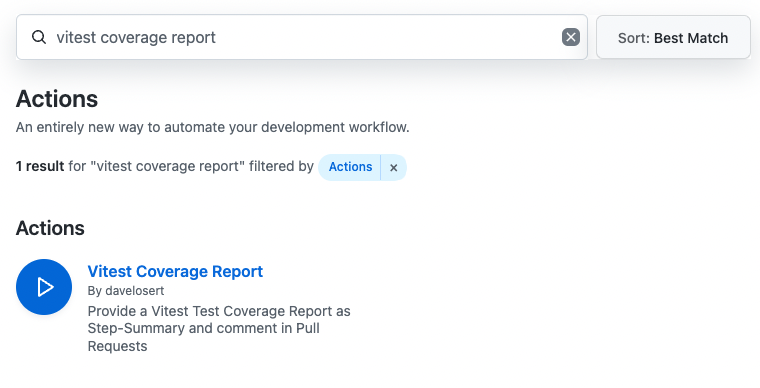
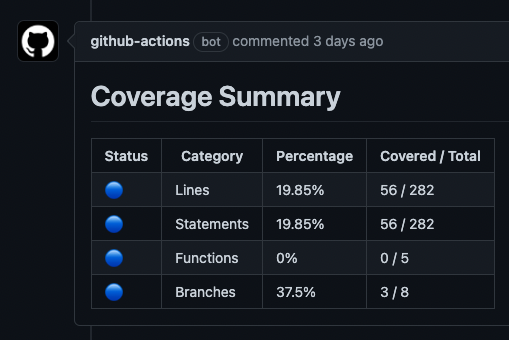
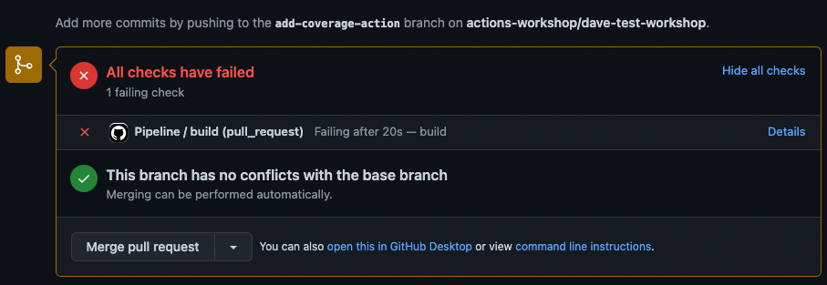

# Part 2 - Basics of CI with Actions

## 1 - Inspect the repository

This repository actually contains a [React](https://reactjs.org/)-application built with [vite](https://vitejs.dev/) that we want to automatically test and build in this part of the workshop.

You can browse through the files if you are interested in how the app itself works (this is not strictly necessary to understand the rest of the workshop though).

- [`src/main.tsx`](../src/main.ts) : is the main entry point of the application
- [`src/pages/Home.tsx`](../src/pages/Home.tsx) : is the route that contains most of what you see when starting the application
- [`src/pages/Home.test.ts`](../src/pages/Home.test.tsx) : contains [`vitest`](https://vitest.dev/) tests which we will run with GitHub Actions
- [`Dockerfile`](../Dockerfile) : a Docker file that package the application in a container for release in a later step.

If if you want to test the application, you can start a Codespaces and run it (`npm run dev`) or test it (`npm test`). If you want to run the application on your local machine, you will need to install Node.js.

To test the container, run `docker build . -t local:latest` to build the image and then `docker run -p 8080:8080 local:latest` to run it. Running these commands locally will require you to install [Docker](https://www.docker.com/).

## 2 - Add Continuous Integration

### 2.1 - Use a starter workflow

To develop a GitHub Workflow process that uses Actions to automate the Continuous Integration process, you can begin by adding a **starter workflow** to the repository:

1. On the initial view of your repository, find and navigate to the **Actions** tab.
2. Click `New workflow`
3. Search for `Node.js`
4. Click **Configure** on the `Node.js` starter workflow
5. From the yml-array in the `node-version` field, remove `14.x` (our app is not compatible with this version)

Commit the `node.js.yml` file to the `main` branch to complete this process of creating our first CI workflow.

<details>
<summary>The `.github/workflows/node.js.yml` will include the contents from below:</summary>

```yml
name: Node.js CI

on:
  push:
    branches: [ "main" ]
  pull_request:
    branches: [ "main" ]

jobs:
  build:

    runs-on: ubuntu-latest

    strategy:
      matrix:
        node-version: [16.x, 18.x]
        # See supported Node.js release schedule at https://nodejs.org/en/about/releases/

    steps:
      - uses: actions/checkout@v3
      - name: Use Node.js ${{ matrix.node-version }}
        uses: actions/setup-node@v3
        with:
          node-version: ${{ matrix.node-version }}
          cache: 'npm'
      - run: npm ci
      - run: npm run build --if-present
      - run: npm test
```

</details>

### 2.2 Understand Actions notations

As you can see, we are now using a second Action in our workflow, `actions/setup-node`, which is used to install a specific version of node onto the runner.

Let's use this example to quickly examine the notations of an Action reference:

- `actions/` references the owner of the action - which translates to a user or organization on GitHub
- `setup-node` references the name of the action - which translates to a repository on GitHub
- `@v3` is the version of the action - which translates to a git tag or general reference (a branch or even a commit-sha) on the repository

This makes it very easy to navigate to the source code of any action by simply appending the `owner` and `name` to github.com, like <https://github.com/{owner}/{name>}. For the example above, this would be <https://github.com/actions/setup-node>.

### 2.3 Understand Matrix builds

Also take note that our workflow is running a [matrix build strategy](https://docs.github.com/en/actions/using-jobs/using-a-matrix-for-your-jobs) with 2 versions of node: 16 and 18. A matrix build lets you execute a job in paralellel with different input parameters. In this case, we are running the same job twice, but with different versions of node.

### Check runs

Your new Actions CI is running on every push, and since you just pushed a new commit with the workflow you created, you will already have a workflow running.


Note that we will need to run tests as part of our CI. You can find most of the tests of this application in the [`../src/pages/Home.test.tsx`](../src/pages/Home.test.tsx) file which in parts looks like below:

```typescript
// ... imports

describe("<Home />", (): void => {
  afterEach((): void => {
    cleanup();
  });

  it("renders the octocats returned from the API.", async (): Promise<void> => {
    const inMemoryAPI = createInMemoryOctocatApi();
    inMemoryAPI.addOctocats([
      createTestOctocat({ id: "#1", name: "Octocat 1" }),
      createTestOctocat({ id: "#2", name: "Octocat 2" }),
    ]);

    renderWithProviders({ component: <Home />, inMemoryApi: inMemoryAPI });

    expect(await screen.findByText("Octocat 1")).toBeDefined();
    expect(screen.getByText("Octocat 2")).toBeDefined();
  });

  // ... more tests

});

```

The result of that last push to main should look like this image:


## 3 - Add Code Coverage to your workflow

It is common when working on the CI part of your project to add more informations to the user, for example the tests "*code coverage*".

The approach is quite simple with GitHub Actions, you decide where and when you want to do a specific task, and you search for a specific Action in the [GitHub Marketplace](https://github.com/marketplace?category=&query=&type=actions&verification=).

### 3.1 - Find an Action in the Marketplace

1. Search an Action in the GitHub Marketplace:  `vitest coverage report`
  

2. Click on the **Vitest Coverage Report** Action.

3. You can read the documentation, and integrate it to your workflow.

### 3.2 - Permissions in a Workflow

This is a good time to briefly talk about the **permissions** of a workflow. Any workflow that interacts with GitHub resources needs a permission to do so. By controlling permissions, GitHub users can ensure that only authorized users or processes are able to perform certain actions, such as calling an API with a private access key, execution certain automations, or deploying to production environments. This helps to prevent unauthorized access to sensitive data, reduce the risk of accidental or malicious changes, and maintain overall security and stability of the codebase. For example:

1. The `actions/checkout` - Action requires read permissions to your repository to be able to do that checkout to the runner machine.
2. The **Vitest Coverage Report** Action wants to write a comment into a Pull Request and thus, needs the permissions for this as well.

Luckily, GitHub Workflows come with a [base set of default permissions](https://docs.github.com/en/actions/security-guides/automatic-token-authentication#permissions-for-the-github_token) and the ability to easily extend different permissions with the `permission` keyword - either on:

- the root of the workflow to set this permission for **all** jobs of this workflow.
- within a [job](https://docs.github.com/en/actions/using-jobs) definition itself to only specify the permissions for this job. This is the recommended approach from a security perspective, as gives the least required privileges to your workflows and jobs

These permissions will be applied to the so called `GITHUB_TOKEN` - but we will talk about this at a later stage.

For now, all you need to know is: As soon as you specify the `permissions`-keyword, the default permissions do not apply anymore, meaning you need to specifically configure all permissions you require in the job or workflow. Let's do this in the next step.

### 3.3 - Update the worklow

1. In the `main` branch, edit the CI workflow `.github/workflows/node.js.yml`

2. Add the `permissions` keyword with the following permissions into the job section:

    ```yml
    build:
      name: "Build and Test"
      runs-on: ubuntu-latest
      permissions:
        # Required to allow actions/checkout to clone the repository onto the runner
        contents: read
        # Required to allow the vitest coverage action to write a comment into the Pull Request
        pull-requests: write
      # ... rest of the node.js.yml
    ```

3. Add the following step in the `build` job section of your workflow, right after the `npm test` step:

    ```yml
        # ... rest of the node.js.yml
        - run: npm run test
        - uses: davelosert/vitest-coverage-report-action@v1
          with:
            vite-config-path: vite.config.ts
    ```
  
4. While you are at it - why don't give the job a more speaking `name`:

    ```yml
      jobs:
        build:
          name: "Build and Test"
          runs-on: ubuntu-latest
      # ... rest of the node.js.yml
    ```

5. Commit the `node.js.yml` file.

### 3.4 Remove the Matrix Strategy

As this is a frontend project, we don't really need a matrix-build here (this is more suited for backend projects that might be running on several Node.js version). Removing the matrix build will also make the test - and coverage reporting - happen only once.

<details>
<summary>Try to remove the matrix build yourself and make the Action only run on Version 16.x. Extend this section to see the solution.</summary>

```yml
jobs:
  build:
    name: "Build and Test"
    runs-on: ubuntu-latest
    permissions:
      contents: read
      pull-requests: write
    steps:
      - uses: actions/checkout@v3
      - name: Use Node.js
        uses: actions/setup-node@v3
        with:
          node-version: 16.x
          cache: 'npm'
      - run: npm ci
      - run: npm run build
      - run: npm run test
      - name: 'Report Coverage'
        uses:  davelosert/vitest-coverage-report-action@v1
        with:
          vite-config-path: vite.config.ts
```

</details>

### 3.5 - Create a new Pull Request

1. Go to the main page of the repository.

2. Click on [`./src/main.tsx`](../src/main.tsx), and edit the file (add a comment for example).

3. Scroll down and click **Create a new branch for this commit and start a pull request**.

4. Click **Propose Changes**.

5. Click **Create pull request**.

6. Wait for the CI to run and you will see a new comment in your pull request with the code coverage.


### 3.6. (optional) - Enforce a certain coverage-threshold with branch proection rules

As you can see, the test-coverage of this project is quite low. Sometimes, we want to enforce a certain coverage on a project, meaning we do not want allow to merge a PR if it reduces the coverage below a certain threshold.

Let's try this out in this project:

1. On the Branch you created above, go into the [`vite.config.ts`](../vite.config.ts) (located at the root level of the repository) and within the `test.coverage`-section, edit it to provide some thresholds like this:

    ```typescript
    coverage: {
      reporter: ["text", "json", "json-summary"],
      lines: 100,
      branches: 100,
      functions: 100,
      statements: 100
    },
    ```

2. Having the coverage thresholds set, our workflow will now fail after the next commit on the `npm test` step. However, as we still want to report the coverage, we need to run the `vitest-coverage-report-action` even if the previous step fails. We can this by adding a `if: always()` statement to the step:
  
      ```yml
      - name: 'Report Coverage'
        uses:  davelosert/vitest-coverage-report-action@v1
        if: always()
        with:
          vite-config-path: vite.config.ts
      ```

3. Commit the changes and wait for the workflow to run through

The `coverage`-step should be failing now. However, this does not yet prevent you from being able to merge this PR. The button to merge is still clickable:



For this to work, we have to make our target branch `main` a protected branch and enforce the `build` Action to be succesful before a merge can be done:

1. Within your repository, go to `Settings` and then to `Branches`.

2. Under `Branch protection rules`, click on `Add Rule`.

3. For the `Branch name pattern`, type `main`.

4. Check the `Require status checks to pass before mergin`.

5. In the appearing search-box, search for `Build and Test` (or whatever name you gave the Job in Step 3.2) and select that job. *(Note that you might also see the Jobs of the previous Matrix Build with a specific Node-Version. You can ignore those.)*
    

6. Scroll down and click `Create`.

If you go back to the PR now, you will see that the merge button is inactive and can not be clicked anymore.


As an administrator, you still can force-merge. 'Normal' users in your repo don't have this option.

> **Note**
> This will now not only prevent people from merging a branch to `main` if the coverage-thresholds are not met, but also if the whole workflow fails for other reasons, e.g. if the build is not working anymore or if the tests are failing in general - which usually is a desired outcome.

So from here on you have two options:

1. Write some more tests (if you are into React 😉)
2. Remove the (admitetly insane) thresholds or lower them to make the workflow pass

## Conclusion

In this lab you have learned how to:

- 👍 Add a new workflow for CI.
- 👍 Search a new GitHub Action, for Code Coverage.
- 👍 Understand and make use of `permissions`
- 👍 Add a new GitHub Action to your workflow.
- 👍 (optionally) Prevent merges on failing tests or coverage thresholds by using Branch Protection rules.

---

Next :

- **[Packaging](003-packaging.md)**
